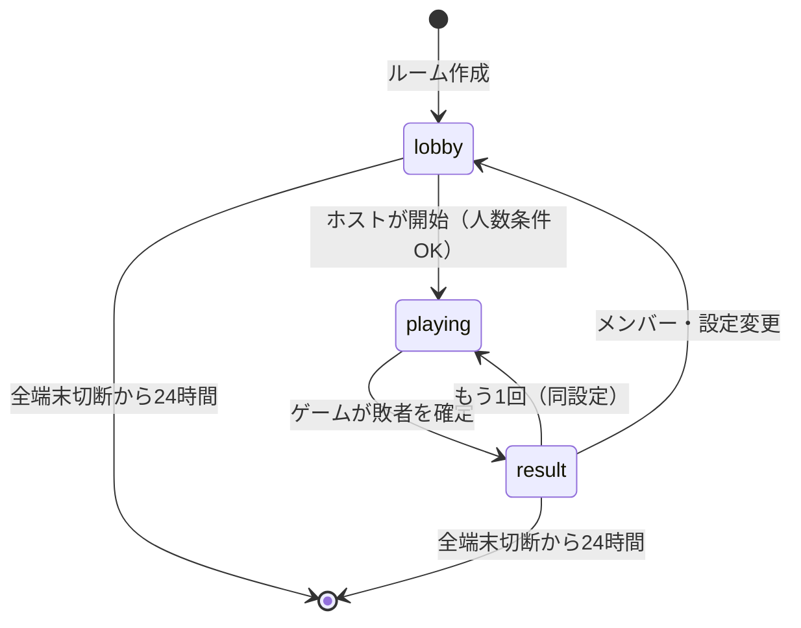

# 共通設計

全ゲームに共通するルーム・端末・通信・ゲームエンジンの設計をまとめる。
個別ゲームのドキュメントは、ここで定義する `GameDefinition` インターフェースに沿って記述する。

## 1. 全体構成

```
[ブラウザ (SPA)] ──WebSocket──> [Worker (ルーティング)] ──> [Room Durable Object (1ルーム=1インスタンス)]
      │                                  │
      └──HTTP (静的アセット)──────────────┘  (Workers Static Assets)
```

- **Worker**
  - `POST /api/rooms` : ルーム作成。ルームコードを発行し、DO を初期化する。
  - `GET  /api/rooms/:code` : ルームの存在確認・ゲーム種別・参加可否（ロビー画面のプレビュー用）。
  - `GET  /api/rooms/:code/ws` : WebSocket アップグレード。`idFromName(code)` で DO に転送する。
  - それ以外は静的アセット（SPA）を返す。`/r/:code` は SPA の参加画面。
- **Room Durable Object**
  - ルームの全状態（端末、プレイヤー、ゲーム状態、累計杯数）を保持する唯一の正（Single Source of Truth）。
  - WebSocket Hibernation API を利用し、待機中の課金を抑える。
  - タイマーは DO Alarm で実装する。
  - ゲームロジックは純粋関数として実装された `GameDefinition` を呼び出すだけにする（DO はI/Oと永続化の責務のみ）。
- **フロントエンド**
  - SPA（React 等を想定）。サーバーから受け取った「その端末向けのビュー」を描画するだけで、ゲームロジックは持たない（楽観的更新もしない。飲み会用途なので遅延は許容範囲）。

## 2. ルームのライフサイクル



- **ルーム作成**：トップページでゲームを選択 → 作成。作成した端末が **ホスト端末** になる。
- **ルームコード**：6文字（紛らわしい文字 `0 O 1 I L` を除いた英大文字＋数字）。参加URLは `https://<host>/r/<code>`。QRコードも表示する。
- **途中参加**：`lobby` と `result` フェーズでのみプレイヤー追加可能。`playing` 中に来た端末は **観戦** として接続し、次のラウンドから参加できる。
- **削除**：最後の接続が切れたら 24 時間後の Alarm で storage を `deleteAll()` する。

## 3. 端末とプレイヤー

「端末（Device）」と「プレイヤー（Player）」を分離するのがこの設計の要点。

```ts
type DeviceId = string;  // 端末ごとに発行。localStorage に保存し再接続時に使う
type PlayerId = string;

interface Device {
  id: DeviceId;
  token: string;           // 再接続認証用の秘密トークン（localStorage）
  isHost: boolean;
  role: 'table' | 'personal';  // 表示の役割（後述）
  connected: boolean;
  lastSeenAt: number;
}

interface Player {
  id: PlayerId;
  name: string;            // 最大12文字
  color: string;           // 自動割当のアイコン色
  deviceId: DeviceId;      // このプレイヤーを操作する端末
  drinks: number;          // ルーム内累計杯数
  passesLeft: number;      // 残りパス権
  active: boolean;         // 次のラウンドに参加するか
  character: CharacterId;  // アイコンに使う動物キャラ（重複なしで自動割当、変更可）
}
```

- **席順**：ルームは `playerOrder: PlayerId[]` を持ち、ロビーでドラッグして実際の座席順（時計回り）に並べ替えられる。手番制のゲーム（101、ライアーダイス）はこの順で回す。開始プレイヤーはランダム。

- 1つの端末に **複数のプレイヤー** をぶら下げられる。
  - 共有タブレット：1端末に全員（または数人）を登録。
  - 各自スマホ：1端末に1プレイヤー。
  - 混在：タブレットに3人、スマホ2台に1人ずつ、なども可能。
- 端末の `role`
  - `personal`：自分のプレイヤーの操作画面を中心に表示する（スマホ）。
  - `table`：場の状況を大きく表示する（テーブルに置いたタブレット）。ぶら下がったプレイヤーの操作も行う。プレイヤー0人の `table` 端末は「観戦用の大画面」になる。
  - デフォルトは「プレイヤー数が1なら personal、それ以外は table」。手動切替可。

### 共有端末での隠し情報（ホットシート）

手札・役職・秘密の選択などを、テーブルに置いた1つの端末で扱うための共通UI。
端末は持ち上げて回さず、置いたまま該当プレイヤーが手元に引き寄せて操作する想定。

1. 「**〇〇さんの番です（他の人は見ないで）**」画面（名前とキャラを大きく表示）
2. 本人が「**自分です（タップで表示）**」を押す → 隠し情報と操作UIを表示
3. 操作完了、または「**隠す**」を押す → 1に戻る（次のプレイヤー）

- サーバーは共有端末にぶら下がった全プレイヤー分のビューを送る。表示の制御はクライアント側で行う（悪意あるユーザーは想定しない。飲み会用途のため）。
- ゲーム側は「今、誰が操作・確認する必要があるか」を `pendingPlayers(state)` で返し、共通UIがそれに従って順番を制御する（席順に並べる）。
- 手元に見る情報がなく、秘密なのは選ぶ操作だけのゲーム（ハイロー・被ったらアウト）は `GameDefinition.directHotseat = true` とし、「自分です」を挟まない。選ぶ番の人（配下プレイヤーのうち `pendingPlayers` の先頭）を「〇〇さんの番」と大きく出し、その人の操作UIをそのまま表示する。
  - 次の人の `playerView` には前の人の選択が含まれないので、目隠しがなくても他人の選択は見えない（選ぶ瞬間を覗かれるのは目隠しがあっても同じ）。
  - 選んだあとに変えることはできない（従来も選ぶと自動で目隠しに戻っていた）。
- 隠し情報がなく、全員が見ている前で操作する手番制のゲーム（欲張りサイコロ・地雷原・グラスすべらせ・ボウリング・ビアポン・ロシアンルーレット）は `GameDefinition.publicBoard = true` とし、ホットシートを使わない。共有端末では、配下プレイヤーのうち `pendingPlayers` に含まれる人の操作UIをそのまま表示する。
  - テーブルに置いた端末を誰かがうっかり触っても進まないよう、盤のマスは「タップで選択 → ボタン（または同じマスをもう一度タップ）で確定」の2段階にする。

## 4. 通信プロトコル（WebSocket）

JSON メッセージ。すべて `type` フィールドを持つ。

> 実装上の正は `app/protocol.ts`。以下は設計時の一覧で、実装ではメッセージ名を一部簡略化している（例：`room.updateConfig` → `room.config`、`room.rematch` は `room.start` に統合、ゲームの切り替え `room.game` と「おまかせで進める」`game.auto` を追加）。

### クライアント → サーバー

| type | ペイロード | 説明 |
| --- | --- | --- |
| `hello` | `{ deviceId?, token?, clientVersion }` | 接続直後に送る。初回は deviceId なしで新規発行 |
| `player.add` | `{ name }` | この端末にプレイヤーを追加 |
| `player.update` | `{ playerId, name?, active? }` | 名前変更・次ラウンド不参加 |
| `player.remove` | `{ playerId }` | 削除（lobby/result のみ） |
| `room.reorderPlayers` | `{ playerOrder }` | 席順の変更（lobby/result のみ） |
| `device.setRole` | `{ role }` | table / personal 切替 |
| `room.updateConfig` | `{ config }` | ゲーム設定の変更（ホストのみ、lobby のみ） |
| `room.start` | `{}` | ゲーム開始（ホストのみ） |
| `room.rematch` | `{}` | もう1回（ホストのみ、result のみ） |
| `room.backToLobby` | `{}` | ロビーに戻る（ホストのみ） |
| `game.action` | `{ playerId, action, seq }` | ゲーム操作。`playerId` はこの端末配下である必要がある |
| `game.auto` | `{}` | おまかせで進める（最後の操作から30秒以上経過時のみ有効。どの端末からでも可） |
| `room.game` | `{ gameId }` | ゲームの切り替え（ホストのみ、lobby/result のみ。ロビーへ移る） |
| `result.pass` | `{ playerId }` | 敗者がパス権を使う |
| `time.ping` | `{ t0 }` | 時刻同期（「おまかせで進める」を出すタイミングの判定用） |

### サーバー → クライアント

| type | ペイロード | 説明 |
| --- | --- | --- |
| `welcome` | `{ deviceId, token, serverTime }` | 端末情報。クライアントは localStorage に保存 |
| `room` | `RoomView` | ルーム全体の公開情報（フェーズ、メンバー、設定、累計杯数）。変更のたびに送信 |
| `game` | `{ version, table, players: Record<PlayerId, PlayerView> }` | ゲーム状態のビュー。`players` はこの端末配下のプレイヤー分のみ |
| `event` | `{ name, data }` | 演出用の一過性イベント（爆発、ルーレット開始など） |
| `ack` | `{ seq }` | 操作の成功 |
| `error` | `{ seq?, code, message }` | 操作の失敗（手番でない、不正な値など） |
| `time.pong` | `{ t0, serverTime }` | 時刻同期の応答 |

- `version` はゲーム状態の単調増加番号。クライアントは古い version を無視する。
- 再接続時はサーバーが最新の `room` と `game` を即送信する（差分ではなく全量。状態が小さいため）。

## 5. ゲームエンジンのインターフェース

各ゲームは以下を実装する。**純粋関数**（乱数・現在時刻は `ctx` から受け取る）とし、ユニットテストしやすくする。

```ts
interface GameDefinition<Config, State, Action, TableView, PlayerView> {
  id: string;                       // 'liars-dice' など
  name: string;
  minPlayers: number;
  maxPlayers: number;
  deviceSupport: { shared: 'best' | 'ok' | 'poor'; personal: 'best' | 'ok' | 'poor' };
  defaultConfig: Config;
  configSchema: ConfigField[];      // 設定UIの自動生成用（数値・選択肢・トグル）
  validateConfig(config: Config, playerCount: number): string | null;

  setup(players: PlayerInfo[], config: Config, ctx: Ctx): Step<State>;
  applyAction(state: State, playerId: PlayerId, action: Action, ctx: Ctx): Step<State> | GameError;
  onTimer(state: State, timerId: string, ctx: Ctx): Step<State>;   // 演出用タイマーのみ
  autoAct(state: State, ctx: Ctx): Step<State>;                    // おまかせで進める

  tableView(state: State): TableView;
  playerView(state: State, playerId: PlayerId): PlayerView;
  pendingPlayers(state: State): PlayerId[];   // 今、操作・確認が必要なプレイヤー（ホットシート・「〇〇待ち」表示用）
}

interface Ctx {
  now: number;             // サーバー時刻(ms)
  random(): number;        // シード付き PRNG（state にシードを保持し再現可能に）
}

interface Step<State> {
  state: State;
  timers?: TimerCommand[];    // { set: id, at } / { clear: id }
  events?: GameEvent[];       // 演出用イベント（全端末に送信）
  result?: RoundResult;       // これが返るとラウンド終了
}

interface RoundResult {
  losers: PlayerId[];          // 通常1人
  reason: string;              // 「爆弾の数字 42 を踏んだ」など表示用
  tieBreak?: { candidates: PlayerId[]; chosen: PlayerId }; // ルーレットを経た場合
  detail: unknown;             // ゲーム固有の結果表示データ
}
```

### DO 側の処理フロー

```
onMessage(game.action)
  → deviceがplayerIdを所有しているか検証
  → def.applyAction(state, playerId, action, ctx)
  → GameError なら error を返す
  → state を storage.put（1キーにまとめて保存）
  → timers をタイマーキューに反映し、最も早いものを setAlarm
  → events をブロードキャスト
  → 各端末に tableView / 配下プレイヤーの playerView を送信
  → result があれば drinks を加算し、room.phase = 'result'
```

### 時間で急かさない

酔った状態では選択に時間がかかるため、**プレイヤーの選択を制限時間で打ち切ることはしない**。
全員（手番制なら手番の人）が選ぶまで待つ。

- タイマー（DO Alarm）は **演出用** にだけ使う（ハイロー・被ったらアウト・狼と子豚の結果公開 → 次へ。3.5〜5秒）。
  各ゲームのタイマーは同時に1つだけなので、`game.timer = { id, at } | null` を保存して `setAlarm` する。
- 待っている人は、画面上部の待ちバーに「〇〇さん待ち」と名前で表示し、周りが声をかけられるようにする。
  - 狼と子豚は、名前を出すと延長戦で狼が推測できるため「あと〇人の選択待ち」と人数だけにする。
- 自分の端末のプレイヤーが新しく待ちになったら、振動で知らせる。

### おまかせで進める

寝落ちや通信切れで止まったときの逃げ道。

- ルームは `game.lastProgressAt`（最後に誰かが操作した、またはゲームが進んだ時刻）を持つ。
- `now - lastProgressAt >= 30秒` のとき、全端末の待ちバーに「おまかせで進める」ボタンを出す。
  - ホスト限定にしない（ホスト自身が寝落ちすることがあるため）。
  - 誤タップ防止のため2段階：1回目で「本当に？もう一度押すと進みます」に変わり、5秒以内にもう一度押すと `game.auto` を送る。
- サーバーは30秒経過を再確認してから `def.autoAct(state, ctx)` を呼ぶ。`autoAct` は待っている人全員の分をアプリが代わりに選ぶ（内容は各ゲームのドキュメント参照）。

### 切断時の扱い

- 切断してもプレイヤーは即座には除外しない。止まった場合は「おまかせで進める」で進める。

## 6. タイブレーク（ルーレット）

同点で敗者が複数になる場合の共通処理。

- ゲームは `tieBreak(candidates, ctx)` ヘルパーを呼び、`ctx.random()` で1人を選ぶ。結果はサーバー側で即確定。
- イベント `roulette` を `{ candidates, chosen, durationMs: 3000 }` で送信し、クライアントは候補者の名前が高速で切り替わって減速し `chosen` で止まる演出を行う。
- 演出中に結果画面を出さないよう、`result` フェーズへの遷移を通知する `room` メッセージに `revealAt`（サーバー時刻）を含め、クライアントはその時刻まで結果を伏せる。

## 7. 結果画面（共通）

- 敗者の名前を大きく表示（「〇〇さん、飲んで！🍺」）、理由、ゲーム固有の詳細。
- 敗者端末では「パス権を使う」ボタン（残りがあれば）。
- ルーム内の累計杯数ランキング（ゲームをまたいで累計）。
- ホスト向けの次の一手：
  - 「もう1回！（ゲーム名）」：同じゲーム・同じ設定ですぐ次のラウンド。
  - 「別のゲームで遊ぶ」：今のゲーム以外のカードを一覧表示。押すとそのゲームのルール説明（ロビー）に移り、ホストが「ゲーム開始！」で始める。今の人数で遊べないゲームは「3〜8人で遊べます（今は9人）」と理由付きで押せなくする。
  - 「メンバー・席順を変える」：同じゲームのままロビーへ。
- ホスト以外の端末はカードを見られるが押せず、「ホストが次のゲームを選んでいます」と表示する。
- ロビーでも上部にゲームカードを横スクロールで並べ、ゲームを切り替えられる（ロビーでは人数が後から増えるので、人数が合わなくても選べる。開始時に人数をチェック）。

### ルールの確認

別のゲームに移ったときにルールが曖昧なまま始まらないよう、詳しいルールをいつでも見られるようにする。

- 中身は `app/games/rules.ts`（`rulesFor(gameId, config)`）。ねらい・流れ・勝ち負け・表・具体例・画面の操作と、全ゲーム共通の決まり（制限時間なし・おまかせ・パス権・タブレットでの交代）。
  - **今の設定に合わせた文面**にする（101 の上限 51 ならカード表から +20 を外す、ライアーダイスの「1はワイルド：ON/OFF」、延長戦の空振りの扱いなど）。
- ルール表示の上部には **「ひと目でわかる」アニメーション** を置く（`app/components/RuleAnimation.tsx`）。文章を読まなくても流れが分かることを優先する。
  - 1ゲーム4〜5コマ。各コマは「動く絵」＋「一言（15文字以内）」＋補足1行。約3.6秒で自動送りし、最後まで行ったら最初に戻る。
  - コマ送り（‹ ›・点）と、止める／再生。絵をタップしても次へ進む。
  - 絵も設定に合わせる（101 の上限値、ライアーダイスのワイルド有無で例の結論が変わる）。
  - 端末が「動きを減らす」設定のときは自動送りせず、アニメーションで出てくる要素は最初から表示する。
- 見られる場所
  - ロビー：参加者の下に詳しいルールをそのまま表示。
  - ヘッダーの「📖ルール」：ロビー・ゲーム中・結果画面のどこからでも、今のゲームのルールをモーダルで開く。
  - ゲームカードの「ルールを見る」：トップ・ロビー・結果画面で、選ぶ前に確認できる（ホスト以外の端末でも押せる）。
- ホストがゲームを切り替えたら、**ホスト以外の端末で新しいゲームのルールを自動で開く**（「次のゲームはこれ！ルールを確認しよう」→「ルールOK！」で閉じる）。ホストはロビーで同じルールを見ているので開かない。

## 8. 永続化

- 状態は小さいため、ルームの全状態（`RoomData`、`app/server/room-core.ts`）を1キー `room` にまとめて、変更のたびに丸ごと `put` する。
  - `configs`：**ゲームごとの設定**（`Record<GameId, Config>`）。ゲームを切り替えて戻ってきても前の設定が残る。
  - `game`：`{ version, state, timer, lastProgressAt }`。
  - そのほか端末・プレイヤー・席順・累計杯数・直前の結果・乱数の状態。
- WebSocket には `serializeAttachment({ deviceId })` で端末IDを紐付け、Hibernation からの復帰時に復元する。

## 9. キャラクターアセット

お題データは持たない（全ゲームがお題不要）。代わりに動物キャラクターを共通アセットとして持つ。

```ts
type CharacterId = 'pig' | 'wolf' | 'cat' | 'dog' | 'rabbit' | 'bear' | 'fox' | 'panda' | 'penguin' | 'frog' | 'lion' | 'owl';

interface Character {
  id: CharacterId;
  name: string;      // 「ネコ」
  color: string;     // テーマカラー（色だけでも区別できるよう、色覚に配慮した12色）
  emoji: string;     // アイコン（初期実装は絵文字。後で SVG に差し替え可能）
}
```

- プレイヤーアイコン：ルーム参加時に未使用のキャラを自動割当。ただし `pig` と `wolf` は狼と子豚で役として使うため、プレイヤーアイコンには割り当てない。
- 被ったらアウト：選択肢の動物として使う。
- 狼と子豚：子豚・狼の立ち絵と、わら・木・レンガの家のイラスト。

## 10. ディレクトリ構成（想定）

```
src/
  worker/
    index.ts            # ルーティング
    room.ts             # Room Durable Object
    protocol.ts         # メッセージ型定義（クライアントと共有）
  games/
    types.ts            # GameDefinition 等
    registry.ts         # id → GameDefinition
    common/tiebreak.ts
    common/cards.ts     # トランプ・デッキ生成・シャッフル
    common/dice.ts
    hundred-one/index.ts
    liars-dice/index.ts
    high-low/index.ts
    kabuttara-out/index.ts
    wolf-and-pigs/index.ts
    greedy-dice/index.ts
    minesweeper/index.ts
    glass-slide/index.ts
    bowling/index.ts
    beer-pong/index.ts
    physics.ts          # 摩擦と円の衝突（グラスすべらせ・ボウリング）
  assets/
    characters/         # 動物キャラ SVG
  client/
    ...                 # SPA。games/<id>/ に各ゲームの UI コンポーネント
```

`src/games` はブラウザと Worker の両方から import できる（型の共有、将来のローカル単体プレイ用）。
